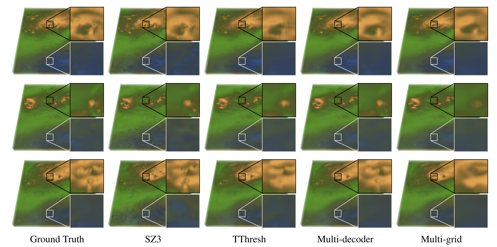

# Evaluation of Volume Representation Networks for Meteorological Ensemble Compression

Kevin Höhlein, Sebastian Weiss and Rüdiger Westermann

## Abstract

Recent studies have shown that volume scene representation networks constitute powerful means to transform 3D scalar fields into extremely compact representations, from which the initial field samples can be randomly accessed. 
In this work, we evaluate the capabilities of such networks to compress meteorological ensemble data, which are comprised of many separate weather forecast simulations. 
We analyze whether these networks can effectively exploit similarities between the ensemble members, and how alternative classical compression approaches perform in comparison. 
Since meteorological ensembles contain different physical parameters with various statistical characteristics and variations on multiple scales of magnitude, we analyze the impact of data normalization schemes on learning quality. 
Along with an evaluation of the trade-offs between reconstruction quality and network model parameterization, we compare compression ratios and reconstruction quality for different model architectures and alternative compression schemes. 

This repository contains the code and settings to reproduce the results of the paper.

## Requirements

 - NVIDIA GPU with RTX, e.g. RTX20xx or RTX30xx (we use an RTX2070)
 - CUDA 11
 - OpenGL with GLFW and GLM
 - Python 3.8 or higher, see [`environment.yml`](environment.yml) for the required packages

Tested system:

- Ubuntu 20.04, gcc 9.3.0, CUDA 11.1, Python 3.8, PyTorch 1.8

## Installation

Training and analysis codes are written in pure Python and rely on fast CUDA implementations from the [pyrenderer](https://github.com/shamanDevel/fV-SRN) project by Sebastian Weiss. 
The project further depends on an installation of the referenced implementations of floating-point compressors [SZ3](https://github.com/szcompressor/SZ3) and [TThresh](https://github.com/rballester/tthresh.git).
A Python environment can be set up using [`environment.yml`](environment.yml). Using `conda`, the project can be set up as follows: 

    conda env create -f environment.yml
    conda activate python38torch18
    bash setup.sh 

The file `setup.sh` is provided for convenience and summarizes the build procedures for the submodules. For details (and common pitfalls) concerning these, we refer to the respective original repositories.

## Project outline

The repository is split into different submodules, providing functionality for data handling, model building, training and evaluation. 
The code has been adapted, restructured and extended based on prior work on the [pyrenderer](https://github.com/shamanDevel/fV-SRN) project. 

### Data preprocessing and access to the data

To allow for compatibillity with pyrenderer, the project assumes that the ensemble dataset is stored in cvol file format.
The script [`data/necker_ensemble/convert_nc_to_cvol.py`](data/necker_ensemble/convert_nc_to_cvol.py) can be used to convert data from NetCDF format to cvol. 
Once the data is converted, the functionality in [`data/necker_ensemble/single_variable.py`](data/necker_ensemble/single_variable.py) can be used to access the data.
The full ensemble dataset cannot be provided and must be requested from [Necker et al. (2020)](https://doi.org/10.1002/qj.3744).

### Model building

The module [`inference.model`](inference/model) provides functionality for flexible design of volume representation networks. Conceptually, the inference procedure from 3D positional coordinates to output field values is subdivided into four steps, which are input parameterization (e.g. extraction of Fourier features from 3D position coordinates), 
latent feature generation (e.g. position sampling from trainable feature grids), core network processing (i.e. application of the neural network), and output parameterization (e.g. post-processing and clamping of network outputs). 
The entry point for all volume representation networks is the `ModularSRN` object in [`inference/model/scene_representation_network/modular_srn.py`](inference/model/scene_representation_network/modular_srn.py), which combines the functionality of the four sub-steps. The implementation of the latent feature modules is located in [`inference/model/latent_features/marginal`](inference/model/latent_features/marginal), the 
implementation of the core networks is found in [`inference/model/pyrenderer/core_network`](inference/model/pyrenderer/core_network). The class `PyrendererSRN` in [`inference/model/pyrenderer/scene_representation_network.py`](inference/model/pyrenderer/scene_representation_network.py) implements the interface between the current project and [pyrenderer](https://github.com/shamanDevel/fV-SRN).

### Model training

Scripts for training models are provided in [`training/univariate`](training/univariate) and [`training/multivariate`](training/multivariate).
The files support a wide range of options for hyper-parameter selection via script arguments. 

### Reproduction of automated experiments

The experiments in the paper have been carried out automatically using scripts as seen in the folder [`experiments`](experiments). 
Data access and storage of results is handled automatically in these scripts, using the functionality and path specifications summarized in [`training/in_out/directories.py`](training/in_out/directories.py). 
The paths in this file must be set before running automated experiments.

### Interface for classical compressors

Functionality related to the classical compression algorithms is found in [`inference/compression`](inference/compression). 
Experiments related to the compressors are located in [`experiments/compression`](experiments/compression).

### Analysis of models and compressors

Code related to the analysis of compression and reconstruction performance of volume representation networks and classical compressors,including plotting functionality is located in [`analysis`](analysis).
The core functionality is implemented in the classes `DeviationStatistics` and `CompressionStatistics` in [`analysis/statistics.py`](analysis/statistics.py). 
The script [`analysis/export_to_pyrenderer.py`](analysis/export_to_pyrenderer.py) can be used to export volume representation networks of type `PyrendererSRN` to pyrenderer format.

### Rendering

Rendering ov volumetric scenes can be achieved using [pyrenderer](https://github.com/shamanDevel/fV-SRN). For an exemplary use case, see e.g. [`data/datasets/univariate/visualization_dataset.py`](data/datasets/univariate/visualization_dataset.py).
